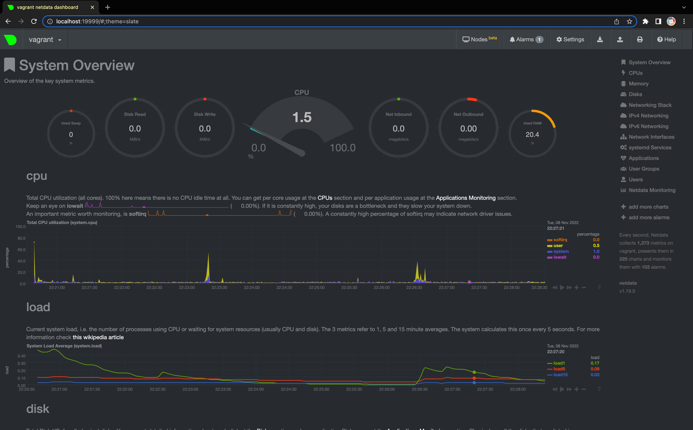
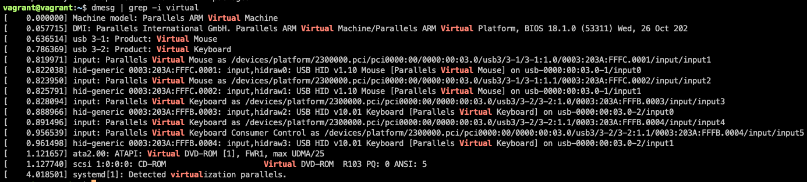
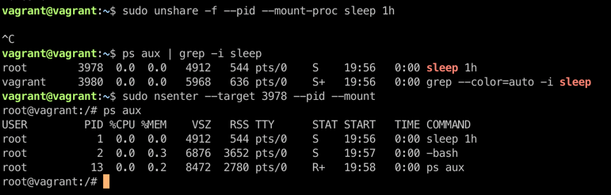

# Домашнее задание к занятию "3.4. Операционные системы, лекция 2"

1. `vagrant@vagrant:~$ cat /etc/systemd/system/node_exporter.service`
```bash
[Unit]
Description=Node Exporter

[Service]
User=node_exporter
EnvironmentFile=/etc/sysconfig/node_exporter
ExecStart=/usr/sbin/node_exporter $OPTIONS

[Install]
WantedBy=multi-user.target

vagrant@vagrant:~$ sudo ss -pnltu | grep 9100
tcp    LISTEN  0       4096                       *:9100                *:*      users:(("node_exporter",pid=720,fd=3))

vagrant@vagrant:~$ sudo systemctl status node_exporter
● node_exporter.service - Node Exporter
     Loaded: loaded (/etc/systemd/system/node_exporter.service; enabled; vendor preset: enabled)
     Active: active (running) since Mon 2022-11-07 20:13:29 UTC; 17s ago
   Main PID: 720 (node_exporter)
      Tasks: 4 (limit: 1060)
     Memory: 13.2M
     CGroup: /system.slice/node_exporter.service
             └─720 /usr/sbin/node_exporter --collector.textfile.directory /var/lib/node_exporter/textfile_collector

Nov 07 20:13:29 vagrant node_exporter[720]: ts=2022-11-07T20:13:29.515Z caller=node_exporter.go:115 level=info collector=thermal_zone
Nov 07 20:13:29 vagrant node_exporter[720]: ts=2022-11-07T20:13:29.515Z caller=node_exporter.go:115 level=info collector=time
Nov 07 20:13:29 vagrant node_exporter[720]: ts=2022-11-07T20:13:29.515Z caller=node_exporter.go:115 level=info collector=timex
Nov 07 20:13:29 vagrant node_exporter[720]: ts=2022-11-07T20:13:29.515Z caller=node_exporter.go:115 level=info collector=udp_queues
Nov 07 20:13:29 vagrant node_exporter[720]: ts=2022-11-07T20:13:29.515Z caller=node_exporter.go:115 level=info collector=uname
Nov 07 20:13:29 vagrant node_exporter[720]: ts=2022-11-07T20:13:29.515Z caller=node_exporter.go:115 level=info collector=vmstat
Nov 07 20:13:29 vagrant node_exporter[720]: ts=2022-11-07T20:13:29.515Z caller=node_exporter.go:115 level=info collector=xfs
Nov 07 20:13:29 vagrant node_exporter[720]: ts=2022-11-07T20:13:29.515Z caller=node_exporter.go:115 level=info collector=zfs
Nov 07 20:13:29 vagrant node_exporter[720]: ts=2022-11-07T20:13:29.515Z caller=node_exporter.go:199 level=info msg="Listening on" address=:9100
Nov 07 20:13:29 vagrant node_exporter[720]: ts=2022-11-07T20:13:29.515Z caller=tls_config.go:195 level=info msg="TLS is disabled." http2=false
```
2. Можно использовать все в олном поиске, например: 

` curl http://localhost:9100/metrics | grep -E 'node_cpu|node_disk|node_filesystem|node_network|node_memory'`
3. 


4.


5. `/sbin/sysctl -n fs.nr_open` - покажет максимальное количество дескрипторов, которые может использовать процесс.
`1048576` кратное 1024.

6. 



7. Это fork bomb.
Эта «команда» при выполнении на ПК не представляет особой опасности, но ее выполнение на сервере может привести к отказу в обслуживании. Это выглядит как странный набор символов, но на самом деле это определение функции bash. В bash вы можете использовать :. И если выполняется команда :(){ :|:& };:, мы создаем именно такую ​​функцию. Внутренне он вызывает себя рекурсивно, то есть работает неопределенно долго, и с помощью & мы инструктируем процесс работать в фоновом режиме.
```bash
vagrant@vagrant:~$ dmesg
[ 8054.410186] cgroup: fork rejected by pids controller in /user.slice/user-1000.slice/session-3.scope

ulimit -u <количество процессов> - ограничит число процессов до нужного(которое будет задано в <количество процессов>)
```
