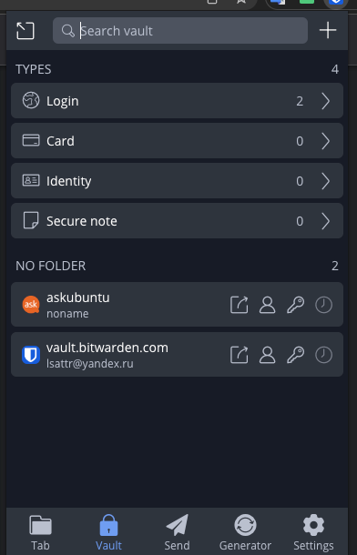
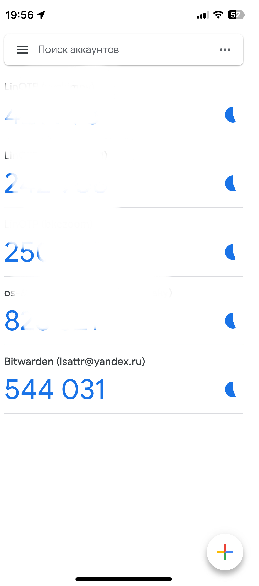
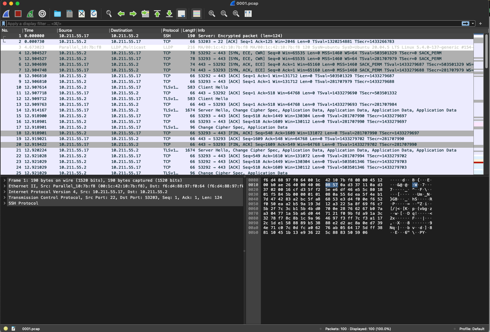

# Домашнее задание к занятию "3.9. Элементы безопасности информационных систем"

1) Установите Bitwarden плагин для браузера. Зарегестрируйтесь и сохраните несколько паролей.



2) Установите Google authenticator на мобильный телефон. Настройте вход в Bitwarden акаунт через Google authenticator OTP.



3) Установите apache2, сгенерируйте самоподписанный сертификат, настройте тестовый сайт для работы по HTTPS.

```bash
vagrant@ubuntu:~$ sudo a2enmod ssl
Considering dependency setenvif for ssl:
Module setenvif already enabled
Considering dependency mime for ssl:
Module mime already enabled
Considering dependency socache_shmcb for ssl:
Enabling module socache_shmcb.
Enabling module ssl.
See /usr/share/doc/apache2/README.Debian.gz on how to configure SSL and create self-signed certificates.
To activate the new configuration, you need to run:
  systemctl restart apache2
vagrant@ubuntu:~$ sudo systemctl restart apache2
vagrant@ubuntu:~$ sudo ufw allow "Apache Full"
Rules updated
Rules updated (v6)
vagrant@ubuntu:~$ sudo openssl req -x509 -nodes -days 365 -newkey rsa:2048 -keyout /etc/ssl/private/apache-selfsigned.key -out /etc/ssl/certs/apache-selfsigned.crt
Generating a RSA private key
................................................................................................................+++++
...+++++
writing new private key to '/etc/ssl/private/apache-selfsigned.key'
-----
You are about to be asked to enter information that will be incorporated
into your certificate request.
What you are about to enter is what is called a Distinguished Name or a DN.
There are quite a few fields but you can leave some blank
For some fields there will be a default value,
If you enter '.', the field will be left blank.
-----
Country Name (2 letter code) [AU]:US
State or Province Name (full name) [Some-State]:Example
Locality Name (eg, city) []:Example
Organization Name (eg, company) [Internet Widgits Pty Ltd]:Example Inc
Organizational Unit Name (eg, section) []:Example Dept
Common Name (e.g. server FQDN or YOUR name) []:10.211.55.17
Email Address []:webmaster@example.com
vagrant@ubuntu:~$ sudo vim /etc/apache2/sites-available/10.211.55.17.conf
vagrant@ubuntu:~$ sudo mkdir /var/www/10.211.55.17
vagrant@ubuntu:~$ sudo vim /var/www/10.211.55.17/index.html
vagrant@ubuntu:~$ sudo a2ensite 10.211.55.17.conf
Enabling site 10.211.55.17.
To activate the new configuration, you need to run:
  systemctl reload apache2
vagrant@ubuntu:~$ sudo apache2ctl configtest
AH00558: apache2: Could not reliably determine the server's fully qualified domain name, using 127.0.2.1. Set the 'ServerName' directive globally to suppress this message
Syntax OK
vagrant@ubuntu:~$ sudo systemctl status apache2.service -l --no-pager
● apache2.service - The Apache HTTP Server
     Loaded: loaded (/lib/systemd/system/apache2.service; enabled; vendor preset: enabled)
     Active: active (running) since Mon 2023-03-06 16:00:31 UTC; 29min ago
       Docs: https://httpd.apache.org/docs/2.4/
    Process: 4316 ExecStart=/usr/sbin/apachectl start (code=exited, status=0/SUCCESS)
   Main PID: 4330 (apache2)
      Tasks: 55 (limit: 1054)
     Memory: 6.1M
     CGroup: /system.slice/apache2.service
             ├─4330 /usr/sbin/apache2 -k start
             ├─4331 /usr/sbin/apache2 -k start
             └─4332 /usr/sbin/apache2 -k start

Mar 06 16:00:31 ubuntu systemd[1]: Starting The Apache HTTP Server...
Mar 06 16:00:31 ubuntu apachectl[4329]: AH00558: apache2: Could not reliably determine the server's fully qualified domain name, using 127.0.2.1. Set the 'ServerName' directive globally to suppress this message
Mar 06 16:00:31 ubuntu systemd[1]: Started The Apache HTTP Server.
vagrant@ubuntu:~$ sudo vim /etc/apache2/apache2.conf
vagrant@ubuntu:~$ sudo systemctl reload apache2
vagrant@ubuntu:~$ sudo vim /etc/apache2/sites-available/10.211.55.17.conf
vagrant@ubuntu:~$ Z^C
vagrant@ubuntu:~$ sudo apachectl configtest
AH00558: apache2: Could not reliably determine the server's fully qualified domain name, using 127.0.2.1. Set the 'ServerName' directive globally to suppress this message
Syntax OK
vagrant@ubuntu:~$ sudo systemctl reload apache2


 ~  curl --insecure -v https://10.211.55.17
*   Trying 10.211.55.17:443...
* Connected to 10.211.55.17 (10.211.55.17) port 443 (#0)
* ALPN: offers h2
* ALPN: offers http/1.1
* (304) (OUT), TLS handshake, Client hello (1):
* (304) (IN), TLS handshake, Server hello (2):
* (304) (IN), TLS handshake, Unknown (8):
* (304) (IN), TLS handshake, Certificate (11):
* (304) (IN), TLS handshake, CERT verify (15):
* (304) (IN), TLS handshake, Finished (20):
* (304) (OUT), TLS handshake, Finished (20):
* SSL connection using TLSv1.3 / AEAD-CHACHA20-POLY1305-SHA256
* ALPN: server accepted http/1.1
* Server certificate:
*  subject: C=US; ST=Example; L=Example; O=Example Inc; OU=Example Dept; CN=10.211.55.17; emailAddress=webmaster@example.com
*  start date: Mar  6 16:16:31 2023 GMT
*  expire date: Mar  5 16:16:31 2024 GMT
*  issuer: C=US; ST=Example; L=Example; O=Example Inc; OU=Example Dept; CN=10.211.55.17; emailAddress=webmaster@example.com
*  SSL certificate verify ok.
> GET / HTTP/1.1
> Host: 10.211.55.17
> User-Agent: curl/7.86.0
> Accept: */*
>
* Mark bundle as not supporting multiuse
< HTTP/1.1 200 OK
< Date: Mon, 06 Mar 2023 17:01:11 GMT
< Server: Apache/2.4.41 (Ubuntu)
< Last-Modified: Mon, 06 Mar 2023 16:28:03 GMT
< ETag: "14-5f63dc773aadf"
< Accept-Ranges: bytes
< Content-Length: 20
< Content-Type: text/html
<
<h1>it worked!</h1>
* Connection #0 to host 10.211.55.17 left intact
```

4) Проверьте на TLS уязвимости произвольный сайт в интернете (кроме сайтов МВД, ФСБ, МинОбр, НацБанк, РосКосмос, РосАтом, РосНАНО и любых госкомпаний, объектов КИИ, ВПК ... и тому подобное).

```bash
~/testssl.sh   3.1dev  ./testssl.sh -U --sneaky https://yandex.ru


###########################################################
    testssl.sh       3.2rc2 from https://testssl.sh/dev/
    (88763f4 2023-02-20 20:29:14)

      This program is free software. Distribution and
             modification under GPLv2 permitted.
      USAGE w/o ANY WARRANTY. USE IT AT YOUR OWN RISK!

       Please file bugs @ https://testssl.sh/bugs/

###########################################################

 Using "LibreSSL 3.3.6" [~72 ciphers]
 on MacBook778:/usr/bin/openssl
 (built: "date not available", platform: "information not available")


Testing all IPv4 addresses (port 443): 5.255.255.80 77.88.55.55 77.88.55.50 5.255.255.88
------------------------------------------------------------------------------------------
 Start 2023-03-06 20:08:41        -->> 5.255.255.80:443 (yandex.ru) <<--

 Further IP addresses:   77.88.55.55 77.88.55.50 5.255.255.88 2a02:6b8:a::a
 rDNS (5.255.255.80):    yandex.ru.
 Service detected:       HTTP


 Testing vulnerabilities

 Heartbleed (CVE-2014-0160)                not vulnerable (OK), no heartbeat extension
 CCS (CVE-2014-0224)                       not vulnerable (OK)
 Ticketbleed (CVE-2016-9244), experiment.  not vulnerable (OK)
 ROBOT                                     not vulnerable (OK)
 Secure Renegotiation (RFC 5746)           supported (OK)
 Secure Client-Initiated Renegotiation     not vulnerable (OK)
 CRIME, TLS (CVE-2012-4929)                not vulnerable (OK)
 BREACH (CVE-2013-3587)                    potentially NOT ok, "br" HTTP compression detected. - only supplied "/" tested
                                           Can be ignored for static pages or if no secrets in the page
 POODLE, SSL (CVE-2014-3566)               not vulnerable (OK)
 TLS_FALLBACK_SCSV (RFC 7507)              Downgrade attack prevention supported (OK)
 SWEET32 (CVE-2016-2183, CVE-2016-6329)    not vulnerable (OK)
 FREAK (CVE-2015-0204)                     not vulnerable (OK)
 DROWN (CVE-2016-0800, CVE-2016-0703)      not vulnerable on this host and port (OK)
                                           make sure you don't use this certificate elsewhere with SSLv2 enabled services, see
                                           https://search.censys.io/search?resource=hosts&virtual_hosts=INCLUDE&q=68C56160382AD96C62E4392A124209B291A40846890AB7832E23101BCA739A85
 LOGJAM (CVE-2015-4000), experimental      not vulnerable (OK): no DH EXPORT ciphers, no DH key detected with <= TLS 1.2
 BEAST (CVE-2011-3389)                     TLS1: ECDHE-ECDSA-AES128-SHA ECDHE-RSA-AES128-SHA
                                           VULNERABLE -- but also supports higher protocols  TLSv1.1 TLSv1.2 (likely mitigated)
 LUCKY13 (CVE-2013-0169), experimental     potentially VULNERABLE, uses cipher block chaining (CBC) ciphers with TLS. Check patches
 Winshock (CVE-2014-6321), experimental    not vulnerable (OK)
 RC4 (CVE-2013-2566, CVE-2015-2808)        no RC4 ciphers detected (OK)


 Done 2023-03-06 20:09:56 [0077s] -->> 5.255.255.80:443 (yandex.ru) <<--

------------------------------------------------------------------------------------------
 Start 2023-03-06 20:09:57        -->> 77.88.55.55:443 (yandex.ru) <<--

 Further IP addresses:   77.88.55.50 5.255.255.88 5.255.255.80 2a02:6b8:a::a
 rDNS (77.88.55.55):     yandex.ru.
 Service detected:       HTTP


 Testing vulnerabilities

 Heartbleed (CVE-2014-0160)                not vulnerable (OK), no heartbeat extension
 CCS (CVE-2014-0224)                       not vulnerable (OK)
 Ticketbleed (CVE-2016-9244), experiment.  not vulnerable (OK)
 ROBOT                                     not vulnerable (OK)
 Secure Renegotiation (RFC 5746)           supported (OK)
 Secure Client-Initiated Renegotiation     not vulnerable (OK)
 CRIME, TLS (CVE-2012-4929)                not vulnerable (OK)
 BREACH (CVE-2013-3587)                    potentially NOT ok, "br" HTTP compression detected. - only supplied "/" tested
                                           Can be ignored for static pages or if no secrets in the page
 POODLE, SSL (CVE-2014-3566)               not vulnerable (OK)
 TLS_FALLBACK_SCSV (RFC 7507)              Downgrade attack prevention supported (OK)
 SWEET32 (CVE-2016-2183, CVE-2016-6329)    not vulnerable (OK)
 FREAK (CVE-2015-0204)                     not vulnerable (OK)
 DROWN (CVE-2016-0800, CVE-2016-0703)      not vulnerable on this host and port (OK)
                                           make sure you don't use this certificate elsewhere with SSLv2 enabled services, see
                                           https://search.censys.io/search?resource=hosts&virtual_hosts=INCLUDE&q=68C56160382AD96C62E4392A124209B291A40846890AB7832E23101BCA739A85
 LOGJAM (CVE-2015-4000), experimental      not vulnerable (OK): no DH EXPORT ciphers, no DH key detected with <= TLS 1.2
 BEAST (CVE-2011-3389)                     TLS1: ECDHE-ECDSA-AES128-SHA ECDHE-RSA-AES128-SHA
                                           VULNERABLE -- but also supports higher protocols  TLSv1.1 TLSv1.2 (likely mitigated)
 LUCKY13 (CVE-2013-0169), experimental     potentially VULNERABLE, uses cipher block chaining (CBC) ciphers with TLS. Check patches
 Winshock (CVE-2014-6321), experimental    not vulnerable (OK)
 RC4 (CVE-2013-2566, CVE-2015-2808)        no RC4 ciphers detected (OK)


 Done 2023-03-06 20:11:13 [0154s] -->> 77.88.55.55:443 (yandex.ru) <<--

------------------------------------------------------------------------------------------
 Start 2023-03-06 20:11:13        -->> 77.88.55.50:443 (yandex.ru) <<--

 Further IP addresses:   77.88.55.55 5.255.255.88 5.255.255.80 2a02:6b8:a::a
 rDNS (77.88.55.50):     yandex.ru.
 Service detected:       HTTP


 Testing vulnerabilities

 Heartbleed (CVE-2014-0160)                not vulnerable (OK), no heartbeat extension
 CCS (CVE-2014-0224)                       not vulnerable (OK)
 Ticketbleed (CVE-2016-9244), experiment.  not vulnerable (OK)
 ROBOT                                     not vulnerable (OK)
 Secure Renegotiation (RFC 5746)           supported (OK)
 Secure Client-Initiated Renegotiation     not vulnerable (OK)
 CRIME, TLS (CVE-2012-4929)                not vulnerable (OK)
 BREACH (CVE-2013-3587)                    no gzip/deflate/compress/br HTTP compression (OK)  - only supplied "/" tested
 POODLE, SSL (CVE-2014-3566)               not vulnerable (OK)
 TLS_FALLBACK_SCSV (RFC 7507)              Downgrade attack prevention supported (OK)
 SWEET32 (CVE-2016-2183, CVE-2016-6329)    not vulnerable (OK)
 FREAK (CVE-2015-0204)                     not vulnerable (OK)
 DROWN (CVE-2016-0800, CVE-2016-0703)      not vulnerable on this host and port (OK)
                                           make sure you don't use this certificate elsewhere with SSLv2 enabled services, see
                                           https://search.censys.io/search?resource=hosts&virtual_hosts=INCLUDE&q=68C56160382AD96C62E4392A124209B291A40846890AB7832E23101BCA739A85
 LOGJAM (CVE-2015-4000), experimental      not vulnerable (OK): no DH EXPORT ciphers, no DH key detected with <= TLS 1.2
 BEAST (CVE-2011-3389)                     TLS1: ECDHE-ECDSA-AES128-SHA ECDHE-RSA-AES128-SHA
                                           VULNERABLE -- but also supports higher protocols  TLSv1.1 TLSv1.2 (likely mitigated)
 LUCKY13 (CVE-2013-0169), experimental     potentially VULNERABLE, uses cipher block chaining (CBC) ciphers with TLS. Check patches
 Winshock (CVE-2014-6321), experimental    not vulnerable (OK)
 RC4 (CVE-2013-2566, CVE-2015-2808)        no RC4 ciphers detected (OK)


 Done 2023-03-06 20:12:31 [0232s] -->> 77.88.55.50:443 (yandex.ru) <<--

------------------------------------------------------------------------------------------
 Start 2023-03-06 20:12:31        -->> 5.255.255.88:443 (yandex.ru) <<--

 Further IP addresses:   77.88.55.55 77.88.55.50 5.255.255.80 2a02:6b8:a::a
 rDNS (5.255.255.88):    yandex.ru.
 Service detected:       HTTP


 Testing vulnerabilities

 Heartbleed (CVE-2014-0160)                not vulnerable (OK), no heartbeat extension
 CCS (CVE-2014-0224)                       not vulnerable (OK)
 Ticketbleed (CVE-2016-9244), experiment.  not vulnerable (OK)
 ROBOT                                     not vulnerable (OK)
 Secure Renegotiation (RFC 5746)           supported (OK)
 Secure Client-Initiated Renegotiation     not vulnerable (OK)
 CRIME, TLS (CVE-2012-4929)                not vulnerable (OK)
 BREACH (CVE-2013-3587)                    no gzip/deflate/compress/br HTTP compression (OK)  - only supplied "/" tested
 POODLE, SSL (CVE-2014-3566)               not vulnerable (OK)
 TLS_FALLBACK_SCSV (RFC 7507)              Downgrade attack prevention supported (OK)
 SWEET32 (CVE-2016-2183, CVE-2016-6329)    not vulnerable (OK)
 FREAK (CVE-2015-0204)                     not vulnerable (OK)
 DROWN (CVE-2016-0800, CVE-2016-0703)      not vulnerable on this host and port (OK)
                                           make sure you don't use this certificate elsewhere with SSLv2 enabled services, see
                                           https://search.censys.io/search?resource=hosts&virtual_hosts=INCLUDE&q=68C56160382AD96C62E4392A124209B291A40846890AB7832E23101BCA739A85
 LOGJAM (CVE-2015-4000), experimental      not vulnerable (OK): no DH EXPORT ciphers, no DH key detected with <= TLS 1.2
 BEAST (CVE-2011-3389)                     TLS1: ECDHE-ECDSA-AES128-SHA ECDHE-RSA-AES128-SHA
                                           VULNERABLE -- but also supports higher protocols  TLSv1.1 TLSv1.2 (likely mitigated)
 LUCKY13 (CVE-2013-0169), experimental     potentially VULNERABLE, uses cipher block chaining (CBC) ciphers with TLS. Check patches
 Winshock (CVE-2014-6321), experimental    not vulnerable (OK)
 RC4 (CVE-2013-2566, CVE-2015-2808)        no RC4 ciphers detected (OK)


 Done 2023-03-06 20:13:44 [0305s] -->> 5.255.255.88:443 (yandex.ru) <<--

------------------------------------------------------------------------------------------
Done testing now all IP addresses (on port 443): 5.255.255.80 77.88.55.55 77.88.55.50 5.255.255.88
```
5) Установите на Ubuntu ssh сервер, сгенерируйте новый приватный ключ. Скопируйте свой публичный ключ на другой сервер. Подключитесь к серверу по SSH-ключу.

```bash
 ~  ssh-keygen
Generating public/private rsa key pair.
Enter file in which to save the key (/Users/yakimov/.ssh/id_rsa):
Enter passphrase (empty for no passphrase):
Enter same passphrase again:
Your identification has been saved in /Users/yakimov/.ssh/id_rsa
Your public key has been saved in /Users/yakimov/.ssh/id_rsa.pub
The key fingerprint is:
SHA256:9gb8EPf/HzePtVh3EoOMkFeh9CveEYcqwF4GqQhQqFY yakimov@MacBook778.local
The key's randomart image is:
+---[RSA 3072]----+
|oo.   ..  . o.   |
|o  E ... o + .   |
|.... .o * + + .  |
|... .. = = = =   |
|.     . S + * o  |
|       . B o o o |
|          = . o+=|
|         .    o=O|
|             ...=|
+----[SHA256]-----+
 ~  ssh-copy-id vagrant@10.211.55.17
/usr/bin/ssh-copy-id: INFO: Source of key(s) to be installed: "/Users/yakimov/.ssh/id_rsa.pub"
The authenticity of host '10.211.55.17 (10.211.55.17)' can't be established.
ED25519 key fingerprint is SHA256:wZB+mQfSqdLQGNJ0ZOsoDssA0eqlRJ+7/XfwfFlmlTY.
This host key is known by the following other names/addresses:
    ~/.ssh/known_hosts:6: 10.211.55.12
Are you sure you want to continue connecting (yes/no/[fingerprint])? yes
/usr/bin/ssh-copy-id: INFO: attempting to log in with the new key(s), to filter out any that are already installed
/usr/bin/ssh-copy-id: INFO: 1 key(s) remain to be installed -- if you are prompted now it is to install the new keys
vagrant@10.211.55.17's password:

Number of key(s) added:        1

Now try logging into the machine, with:   "ssh 'vagrant@10.211.55.17'"
and check to make sure that only the key(s) you wanted were added.

 ~  ssh vagrant@10.211.55.17
Welcome to Ubuntu 20.04.5 LTS (GNU/Linux 5.4.0-137-generic aarch64)

 * Documentation:  https://help.ubuntu.com
 * Management:     https://landscape.canonical.com
 * Support:        https://ubuntu.com/advantage

  System information as of Mon 06 Mar 2023 05:27:11 PM UTC

  System load:           0.92
  Usage of /:            20.0% of 30.59GB
  Memory usage:          48%
  Swap usage:            0%
  Processes:             143
  Users logged in:       1
  IPv4 address for eth0: 10.211.55.17
  IPv6 address for eth0: fdb2:2c26:f4e4:0:21c:42ff:fe10:7bf8

 * Introducing Expanded Security Maintenance for Applications.
   Receive updates to over 25,000 software packages with your
   Ubuntu Pro subscription. Free for personal use.

     https://ubuntu.com/pro


This system is built by the Bento project by Chef Software
More information can be found at https://github.com/chef/bento
Last login: Mon Mar  6 16:12:33 2023 from 10.211.55.2
vagrant@ubuntu:~$
```

6) Переименуйте файлы ключей из задания 5. Настройте файл конфигурации SSH клиента, так чтобы вход на удаленный сервер осуществлялся по имени сервера.
```bash
 ✘ ⚙  ~  mv .ssh/id_rsa .ssh/ubuntu
 ✘ ⚙  ~  cat .ssh/config

# --- Sourcetree Generated ---
Host yakimov778-GitHub
	HostName github.com
	User yakimov778
	PreferredAuthentications publickey
	IdentityFile /Users/yakimov/.ssh/id_ed25519
	UseKeychain yes
	AddKeysToAgent yes
# ----------------------------
Host ubuntu
     HostName 10.211.55.17
     User vagrant
     IdentityFile ~/.ssh/ubuntu


 ⚙  ~  ssh ubuntu
Welcome to Ubuntu 20.04.5 LTS (GNU/Linux 5.4.0-137-generic aarch64)

 * Documentation:  https://help.ubuntu.com
 * Management:     https://landscape.canonical.com
 * Support:        https://ubuntu.com/advantage

  System information as of Mon 06 Mar 2023 05:37:01 PM UTC

  System load:           0.16
  Usage of /:            20.0% of 30.59GB
  Memory usage:          47%
  Swap usage:            0%
  Processes:             144
  Users logged in:       1
  IPv4 address for eth0: 10.211.55.17
  IPv6 address for eth0: fdb2:2c26:f4e4:0:21c:42ff:fe10:7bf8

 * Introducing Expanded Security Maintenance for Applications.
   Receive updates to over 25,000 software packages with your
   Ubuntu Pro subscription. Free for personal use.

     https://ubuntu.com/pro


This system is built by the Bento project by Chef Software
More information can be found at https://github.com/chef/bento
Last login: Mon Mar  6 17:35:48 2023 from 10.211.55.2) 
```
7) Соберите дамп трафика утилитой tcpdump в формате pcap, 100 пакетов. Откройте файл pcap в Wireshark.
8) 
```bash
vagrant@ubuntu:~$ sudo tcpdump -c 100 -w 0001.pcap -i eth0
tcpdump: listening on eth0, link-type EN10MB (Ethernet), capture size 262144 bytes
100 packets captured
102 packets received by filter
0 packets dropped by kernel

```
