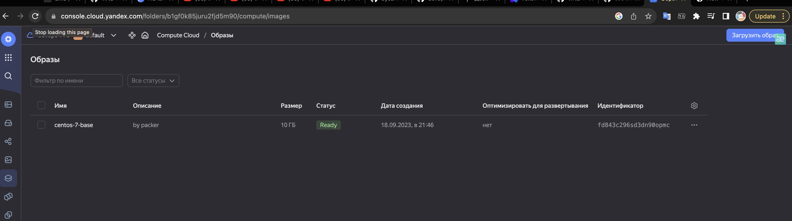
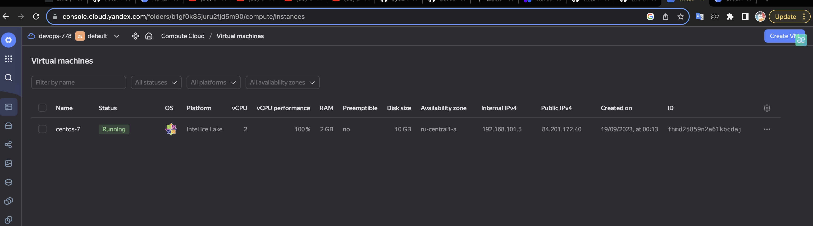
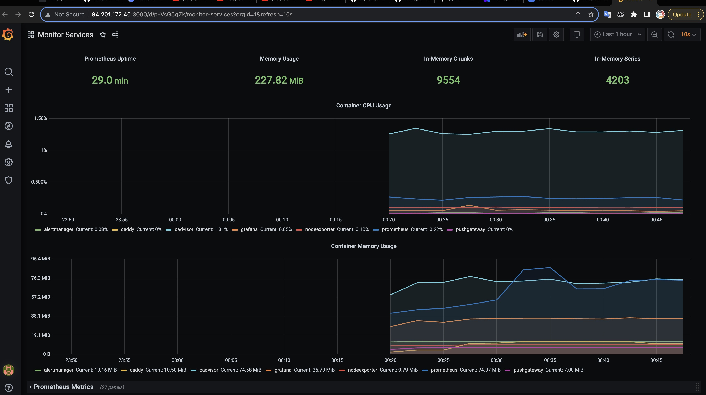

# Домашнее задание к занятию 4. «Оркестрация группой Docker-контейнеров на примере Docker Compose»
---

## Задача 1

Создайте собственный обр:



## Задача 2

2.1. Создайте вашу первую виртуальную машину в YandexCloud с помощью web-интерфейса YandexCloud.



## Задача 3

С помощью Ansible и Docker Compose разверните на виртуальной машине из предыдущего задания систему мониторинга на основе Prometheus/Grafana. Используйте Ansible-код в директории (src/ansible).
```bash
[centos@centos-7 ~]$ sudo docker ps
CONTAINER ID   IMAGE                              COMMAND                  CREATED         STATUS                   PORTS                                                                              NAMES
fecac30c3b74   grafana/grafana:7.4.2              "/run.sh"                3 minutes ago   Up 3 minutes             3000/tcp                                                                           grafana
302ca308d7cc   stefanprodan/caddy                 "/sbin/tini -- caddy…"   3 minutes ago   Up 3 minutes             0.0.0.0:3000->3000/tcp, 0.0.0.0:9090-9091->9090-9091/tcp, 0.0.0.0:9093->9093/tcp   caddy
90a6bff1246d   prom/node-exporter:v0.18.1         "/bin/node_exporter …"   3 minutes ago   Up 3 minutes             9100/tcp                                                                           nodeexporter
82d474e1350a   prom/alertmanager:v0.20.0          "/bin/alertmanager -…"   3 minutes ago   Up 3 minutes             9093/tcp                                                                           alertmanager
0d8c730bc37f   prom/prometheus:v2.17.1            "/bin/prometheus --c…"   3 minutes ago   Up 3 minutes             9090/tcp                                                                           prometheus
68227d50fc9d   gcr.io/cadvisor/cadvisor:v0.47.0   "/usr/bin/cadvisor -…"   3 minutes ago   Up 3 minutes (healthy)   8080/tcp                                                                           cadvisor
9d75ac9a802b   prom/pushgateway:v1.2.0            "/bin/pushgateway"       3 minutes ago   Up 3 minutes             9091/tcp                                                                           pushgateway
[centos@centos-7 ~]$ logout
```

## Задача 4

Откройте веб-браузер, зайдите на страницу http://<внешний_ip_адрес_вашей_ВМ>:3000.
Используйте для авторизации логин и пароль из .env-file.
Изучите доступный интерфейс, найдите в интерфейсе автоматически созданные docker-compose-панели с графиками(dashboards).
Подождите 5-10 минут, чтобы система мониторинга успела накопить данные.



